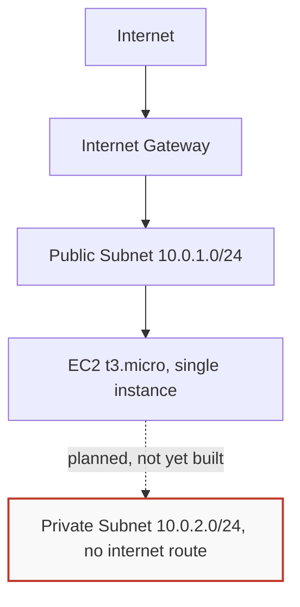

# STRIDE Threat Model: AWS Secure Infrastructure Foundations

A threat analysis of the VPC, EC2, and S3 architecture documented in
cloudsec-aws-vpc-foundations, using the STRIDE framework. Includes one gap I found and
have not yet fixed, because an honest threat model records real risk, not just the
controls already in place.

## Architecture Under Review

## STRIDE Analysis

| Category | Breaks | Threat | What stops it |
|---|---|---|---|
| Spoofing | Authentication | Someone pretends to be a real visitor, or intercepts a session | HTTPS on all traffic. SSH key pairs instead of passwords for server access |
| Tampering | Integrity | Someone changes server config or a bucket policy without permission | Linux file permissions. IAM policies restricting who can call which actions. CloudTrail recording every change |
| Repudiation | Accountability | Someone takes a destructive action and there is no way to prove who did it | Individual IAM users, never a shared account, combined with CloudTrail. Both are needed. CloudTrail alone still just logs "the shared account did this," which proves nothing about which person actually did it |
| Information Disclosure | Confidentiality | Sensitive data becomes reachable from the public internet | The private subnet has no route to the Internet Gateway at all. This is a network design decision, not something a password protects |
| Denial of Service | Availability | A traffic flood overwhelms the single EC2 instance. This is a real gap I have not fixed yet | A Security Group checks who is allowed in, it does not check how much traffic is coming. It cannot stop a flood of requests that all pass its rules. The actual fix is a load balancer spreading traffic across multiple instances, not a stricter firewall rule |
| Elevation of Privilege | Least Privilege | A leaked credential grants more access than it should | How much damage is possible depends entirely on the policy attached to that credential. See the comparison below |

## What a Leaked Credential Could Actually Do

I wanted this to be concrete instead of abstract, so I compared two credentials I
built and tested myself in this same account.

**A leaked AdministratorAccess credential could:**
- Delete every S3 bucket, every RDS database, every EC2 instance, and the whole VPC.
  All of it, including backups
- Launch expensive compute, GPU instances for example, to mine cryptocurrency and run
  up a large bill within hours
- Delete the real IAM users and lock the whole team out of the account
- Create a hidden admin account, download everything, and hold the account for ransom

**A leaked read only S3 role credential could:**
- View and download files from the one bucket it was scoped to
- Nothing else. I tested this directly. While signed in under this role, I tried to
  call iam:GetRole and AWS returned Access Denied, stating plainly that no policy
  attached to this identity allowed the action

## How the IAM Role Was Actually Verified

- Created a second IAM Role with a permissions policy scoped to S3 read access only
- Opened its trust policy and confirmed that sts:AssumeRole is the specific action
  that controls who is allowed to become this role, separate entirely from the
  permissions policy that controls what the role can do once assumed
- Switched into the role through the console and confirmed the resulting identity's
  ARN changes format to arn:aws:sts, assumed-role, proof that this is a temporary
  session issued by STS, not a permanent identity
- Confirmed the boundary was real by testing an action outside its scope and getting
  denied, not by assuming it would work

## What I Would Fix First

Of everything above, the Denial of Service gap and the blast radius from an
overly broad IAM policy are the two I would fix before putting any of this near
production. Everything else already has a working control behind it.

## Author
Sheriffdeen, JebsonSEO. Building toward Cloud Security Engineering.
