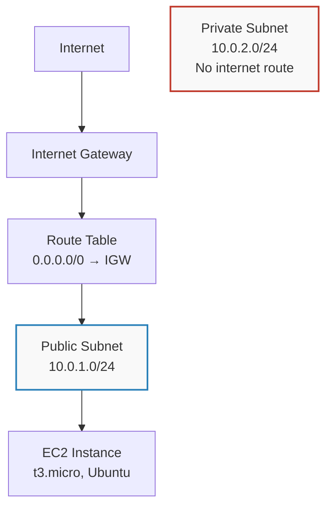

# AWS Secure Infrastructure Foundations

Hands-on lab work covering network segmentation, least-privilege IAM design, and a
deliberately-recreated S3 misconfiguration breach pattern built, broken, and fixed
personally in a live AWS account.

## 1. Network Architecture — VPC Segmentation

Designed and built a VPC with public/private subnet separation, so that a compromised
web tier cannot directly reach the data tier network-level defense, not just
password-based protection.



**Design decisions:**
- VPC CIDR `10.0.0.0/16`, subnets sliced as `/24`s for clear separation
- Only the public subnet is associated with the internet-routing table; the private
  subnet falls back to the VPC's default (no-internet) main route table
- Security Group on the EC2 instance restricts inbound SSH to a single known IP
  never `0.0.0.0/0`
- Key pair-based SSH access only; no password authentication

## 2. IAM — Least Privilege Policy Design

Rather than relying on broad `AdministratorAccess` for ongoing work, designed a scoped
policy limited to exactly the actions needed:

```json
{
  "Version": "2012-10-17",
  "Statement": [
    {
      "Effect": "Allow",
      "Action": ["s3:GetObject", "s3:ListBucket"],
      "Resource": "*"
    }
  ]
}
```

This policy grants **read-only** S3 access no write, no delete, no ability to modify
bucket permissions. Demonstrates the Principle of Least Privilege in a real, working
policy rather than as a definition.

## 3. Security Lab: Recreating the S3 Public Bucket Breach Pattern

One of the most common real-world cloud breaches is a misconfigured S3 bucket exposed
to the public internet. This lab deliberately recreates that exact failure mode in a
controlled environment, to understand both the mechanism and the fix.

### Steps taken
1. Created a bucket with AWS's default protection (**Block Public Access: ON**)
2. Confirmed uploaded object returned `403 Access Denied` when accessed via public URL
3. Deliberately disabled Block Public Access and attached a bucket policy with
   `"Principal": "*"` simulating the exact misconfiguration behind real breaches
4. Confirmed the object was now publicly accessible
5. **Immediately remediated:** re-enabled Block Public Access, deleted the permissive
   policy, and reconfirmed `403 Access Denied`

### Root cause analysis
The breach pattern requires two independent failures to align:
- Block Public Access disabled (an account/bucket-level safeguard turned off)
- A bucket policy explicitly granting public read access

Either safeguard alone would have prevented exposure. This is why AWS's Block Public
Access exists as an *override* it protects even against an already-misconfigured
policy, unless deliberately disabled.

### Verification via CloudTrail
The `PutBucketPolicy` API call was independently confirmed in CloudTrail, showing the
exact IAM identity, timestamp, and source IP responsible for the change demonstrating
that every configuration change in AWS is individually attributable (non-repudiation).

## Tools & Services Used
AWS VPC · EC2 · S3 · IAM · CloudTrail · CloudWatch

## Author
Sheriffdeen (JebsonSEO) : building toward Cloud Security Engineering
