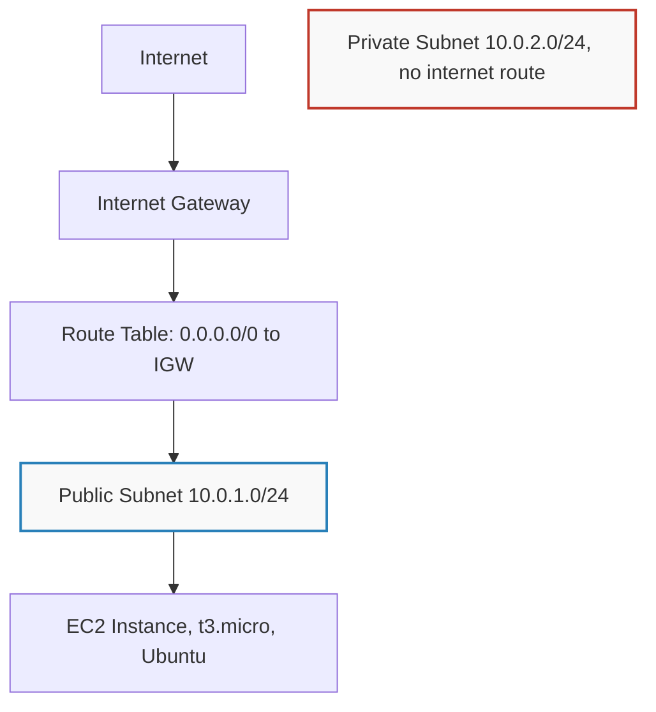

# AWS Secure Infrastructure Foundations

Hands-on lab work covering network segmentation, least privilege IAM design, and a
recreated S3 misconfiguration breach. Built, broken, and fixed personally in a live
AWS account.

## 1. Network Architecture: VPC Segmentation

I designed and built a VPC with separate public and private subnets, so that a
compromised web server cannot reach the database directly. The database is protected
by network design, not just by a password.



**Decisions made:**
- VPC CIDR set to `10.0.0.0/16`, with subnets sliced into `/24`s for a clear split
  between public and private
- Only the public subnet is attached to the internet routing table. The private
  subnet is left on the VPC's default route table, which has no path to the internet
- The Security Group on the EC2 instance allows SSH only from one known IP address,
  never from anywhere on the internet
- Login to the server uses a key pair, not a password

## 2. IAM: Least Privilege Policy Design

Instead of leaving broad admin access attached for ongoing work, I wrote a policy
scoped to exactly what was needed.

```json
{
  "Version": "2012-10-17",
  "Statement": [
    {
      "Effect": "Allow",
      "Action": ["s3:GetObject", "s3:ListBucket"],
      "Resource": "*"
    }
  ]
}
```

This grants read only access to S3. No write, no delete, no ability to change bucket
permissions. It is a working example of least privilege, not just a definition of it.

## 3. Lab: Recreating the S3 Public Bucket Breach

One of the most common real world cloud breaches is a misconfigured S3 bucket left
open to the public. I recreated that exact failure on purpose, in a controlled way,
to understand both how it happens and how to fix it.

### What I did
1. Created a bucket with AWS's default protection turned on, Block Public Access
2. Confirmed the uploaded file returned a 403 Access Denied when I tried to open its
   public URL
3. Turned off Block Public Access and attached a bucket policy allowing access from
   anyone, the same misconfiguration behind real world breaches
4. Confirmed the file was now publicly reachable
5. Reversed both changes immediately. Re-enabled Block Public Access, deleted the
   open policy, and confirmed the file went back to returning Access Denied

### Why the breach requires two failures, not one
A bucket only becomes public if two separate protections fail at the same time.
Block Public Access has to be turned off, and the bucket policy has to explicitly
allow public access. Either protection alone would have stopped it. This is why
Block Public Access exists as an override sitting above the policy itself. It blocks
public access even if the policy is already misconfigured to allow it, unless someone
deliberately disables it.

### Checked in CloudTrail
The exact API call that changed the bucket policy, PutBucketPolicy, is recorded in
CloudTrail with the IAM identity that made the change, the time it happened, and the
source IP address. Every configuration change in this account can be traced back to a
specific person. Nothing happens anonymously.

## Tools and Services Used
AWS VPC, EC2, S3, IAM, CloudTrail, CloudWatch

## Author
Sheriffdeen, JebsonSEO. Building toward Cloud Security Engineering.
